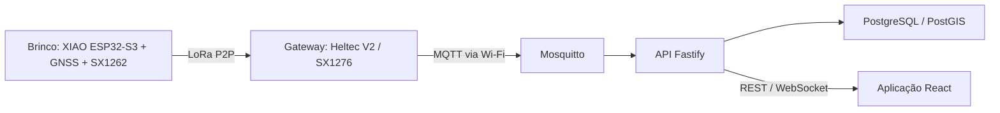

# Cattle Tracker — firmware e hardware

Brinco eletrônico com GNSS e LoRa e gateway receptor. A aplicação web, API, banco e infraestrutura ficam em [cattle-tracker-web](https://github.com/MateussGont/cattle-tracker-web). Protótipo em validação; os problemas conhecidos e os ensaios necessários estão documentados.



## Comece aqui

- [Planejamento semanal: piloto até 28/02/2027, com 5 h semanais da equipe](docs/planejamento-semanal.md).
- [Project: tarefas dos dois repositórios](https://github.com/users/MateussGont/projects/1) e [backlog priorizado](docs/backlog.md).
- [Plano de evolução e critérios de avanço](docs/plano-evolucao.md).
- [Manual de cadastro do brinco](docs/manual-cadastro-brinco.md).
- [Revisão completa do firmware](docs/revisao-firmware.md) e [revisão de código e arquitetura](docs/revisao-cattle-tracker-lora.md).
- [Separação, contratos e distribuição do firmware](docs/separacao-repositorios.md).

## Estrutura

| Caminho | Responsabilidade |
| --- | --- |
| firmware/collar | Brinco transmissor; nome técnico mantido por compatibilidade |
| firmware/receiver | Gateway e cliente MQTT |
| firmware/common | Codificação e validação do protocolo binário |
| test | Teste nativo do protocolo |
| scripts | Exportação da imagem completa e cálculo de airtime |
| docs | Revisões, decisões, manuais e evolução |

## Estado do protótipo

Rádio atual: 915 MHz, BW125, SF7, CR4/5, preâmbulo 8, rede privada; pacote v1 de 26 bytes. O ciclo atual inclui janela GNSS de 2,5 s e espera de 10 s, portanto não produz intervalo exato de 10 s. Bateria ainda é enviada como zero sem medição real. Recepção do gateway e provisionamento serial precisam de melhorias antes dos ensaios multinós.

A documentação anterior indica GNSS TX → XIAO D7/GPIO44 (RX), enquanto o firmware atual configura RX43/TX44. Confira a placa e resolva [#26](https://github.com/MateussGont/cattle-tracker-lora/issues/26) antes de seguir a ligação como validada. Os parâmetros RF e de alimentação devem ser conferidos no hardware; a revisão não representa teste em placa.

## Compilar e gravar

Com PlatformIO e dependências do projeto preparados (a primeira compilação pode baixá-los):

```text
pio run -e collar_xiao_sx1262
pio run -e receiver_heltec_v2
pio run -e collar_xiao_sx1262 -t upload
pio run -e receiver_heltec_v2 -t upload
pio device monitor -b 115200
```

Prepare localmente firmware/receiver/secrets.h a partir de secrets.h.example. As credenciais devem corresponder ao broker da aplicação web. Conecte as antenas corretas antes de transmitir. Não publique credenciais nem imagens de gateway que as contenham.

Para gerar a imagem completa usada no cadastro USB, após compilar o brinco:

```text
node scripts/sync-firmware.mjs
```

Saída: dist/firmware/collar-latest.bin e SHA-256 no terminal. A [aplicação web importa esse artefato](docs/separacao-repositorios.md); não é preciso compilar firmware para iniciar o site.

## Verificações independentes

```text
g++ -std=c++11 -Wall -Wextra -pedantic test/test_protocol.cpp -o test_protocol
./test_protocol
node scripts/radio-budget.mjs
```

No Windows, use test_protocol.exe para o executável. O cálculo é teórico e não mede cobertura, interferência, autonomia ou conformidade. Testes web, builds PlatformIO e ensaios físicos permanecem nos critérios das issues.

## Histórico

Extração web baseada em 4a85dff8f089703848c17a84e3efa5dc6f7a9943, preservada pela tag pre-web-split-4a85dff8. Consulte [CONTRIBUTING.md](CONTRIBUTING.md) antes de iniciar uma tarefa.
